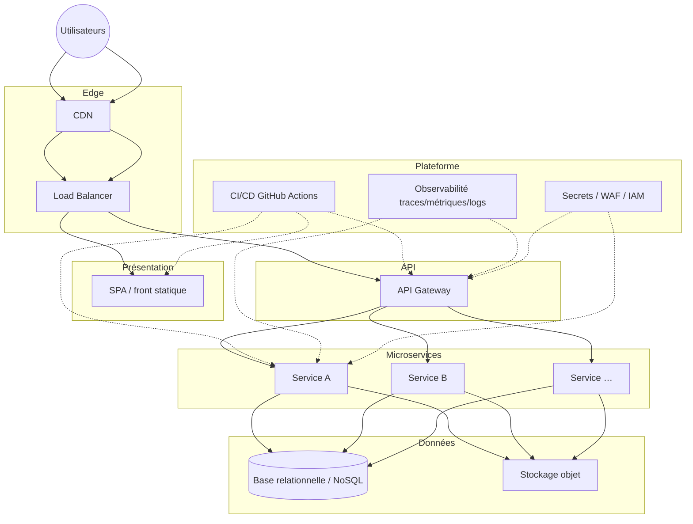
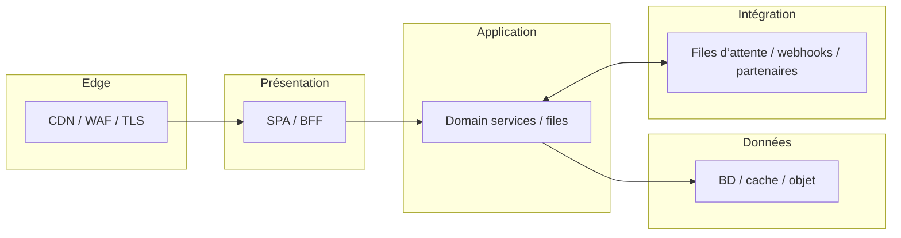
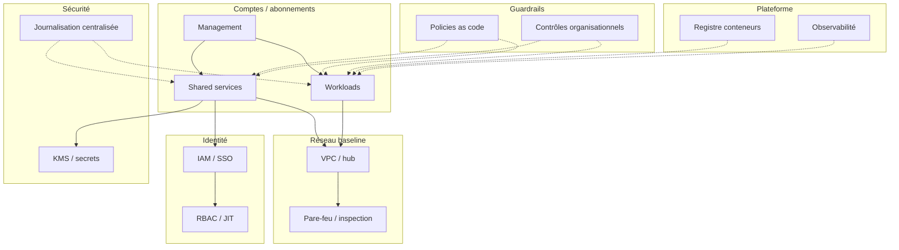
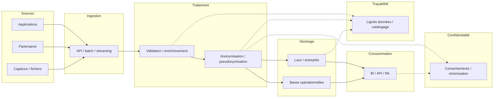

# Diagrammes d’architecture (sources Mermaid)

Ce dossier regroupe des **schémas source** réutilisables dans la documentation (GitHub, wiki, exports SVG/PNG via outils Mermaid). Les blocs ci-dessous sont **copier-coller** dans tout éditeur compatible Mermaid.

## Contenu attendu (hors README)

- Schémas **landing zone** (abonnements, réseau, identité, journalisation) — voir `landing-zone-notes.md`
- Diagrammes exportés (PNG/SVG) depuis Miro, draw.io ou équivalent si vous versionnez des exports
- Alignement des CIDR sur `peltiez/docs/network-ip-plan.md` ; toute divergence doit être tracée (PR ou légende du schéma)

## Bonnes pratiques

- Nommer les exports par sujet et date (`landing-zone-2026-05.png`) pour la traçabilité présentation / audit
- Ne pas y placer de **secrets** (clés, jetons) : uniquement flux et agrégats CIDR anonymisés ou gabarits

---

## Contexte CirculAI / déploiement actuel

Le dépôt applicatif vit sous la racine **`peltiez`** : intégration **GitHub** (CI), hébergement **Vercel** pour la SPA et les routes associées. Point d’ancrage Git pour la stratégie de réécriture SPA : commit **`4478e7d`**.

---

## 1. Infrastructure cible (vue logique)

---

## 2. Couches de déploiement (edge → intégration)

---

## 3. Landing zone (composants types)

---

## 4. Flux de données (traçabilité et vie privée)

---

## Fichiers complémentaires

- **`landing-zone-notes.md`** : pistes de modules IaC et dépendances (sans fichier `.tf` factice).
