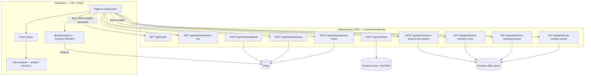

# Arborescence fonctionnelle — Routes SPA ↔ API IGOR

Vue **réaliste** (simplifiée) : le front **React** consomme surtout **base44** (client) pour les données métier ; le serveur **Express** (`server/sovereignApp.js`) expose des routes **REST** pour Stripe, CRM, Atlas et santé.

## Schéma global

## Routes SPA (échantillon — voir `src/App.jsx`)

| Chemin | Rôle |
|--------|------|
| `/` | Accueil |
| `/marketplace` | Annonces |
| `/legal`, `/charte` | Cadre légal / charte |
| `/carte-site` | Cartographie & glossaire |
| `/pricing`, `/abonnement` | Offres / checkout côté UI |
| `/api/*` | **Pas** servi par Vite en prod : appels vers **origine** du site ou `VITE_*` proxy selon config déploiement |

> En développement local, le front (`5173`) et l’API (`8787`) sont **des origines différentes** : CORS et variables `STRIPE_ALLOWED_ORIGINS` / `PUBLIC_SITE_URL` doivent être alignés.

## Mise à jour du schéma

1. Ajouter une route dans `sovereignApp.js` → documenter ici.  
2. Ajouter une page dans `App.jsx` → référencer dans `docs/MANUAL-QA-PROTOCOL.md` pour les tests manuels.
