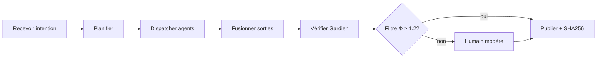

# Alliance IA EGOR69 — Protocole OMÉGA et ponts techniques

**Édition CirculAI · Québec, 2026**  
**Auteurs :** Dominic Peltier / Igor 69  
**Statut :** cadre opérationnel — heuristiques à calibrer sur pilote ; **pas** des lois physiques ni un substitut au consentement humain.

---

## Résumé exécutif

Aucune intelligence artificielle isolée ne couvre l’ensemble des besoins d’une plateforme vivante comme EGOR69 : raisonnement long, créativité narrative, vérification factuelle, vision, routage économique, modération éthique. Chaque moteur excelle dans un registre et faiblit ailleurs. L’**alliance IA** est la décision d’**orchestrer** ces forces au lieu de les fusionner en une « super-IA » mythique.

**Forces complémentaires (typologie réaliste).**

| Famille | Force | Limite fréquente | Rôle dans l’alliance |
|---------|--------|------------------|----------------------|
| Modèles généralistes (GPT-class) | Synthèse, code, dialogue | Hallucinations, coût | Orchestrateur / Scribe |
| Modèles créatifs | Ton, UX copy, scénarios | Véracité faible | Agent créatif (sous filtre) |
| Modèles « raisonnement » | Décomposition, plans | Latence, sur-confiance | Planificateur |
| Vision / multimodal | Images, OCR planches | Contexte métier | Agent vision (si branché) |
| Règles & code déterministe | Stripe, SHA256, routes Express | Pas de « sens » | Gardien + Cartographe |
| Humain (Dominic, communauté, SCALE) | Consentement, légal, goût | Bande passante | Validation finale |

**Principe directeur :** l’orchestrateur **route**, **journalise**, **fusionne** ; il ne **remplace** pas la décision à enjeu (paiement, publication publique, suppression, données personnelles).

**OMÉGA** (opérationnel, non mystique) désigne cinq piliers mesurables : **Holo** (vue d’ensemble des flux), **Sym** (symbiose humain–machine), **Neg** (négentropie = réduction du désordre inutile), **Shapley** (attribution équitable des contributions), **Circ** (routage circulaire des messages entre agents). Le score composite **Ω_op** sert de tableau de bord interne — à calibrer, jamais affiché comme « vérité cosmique ».

**Engagement EGOR69 :** brancher **uniquement** les agents réellement disponibles (API documentées, clés en vault) ; étiqueter le reste « vision » ; preuves **SHA256** sur artefacts companion ; **pas** de Merkle/L2 « blockchain » sur la vitrine sans label **futur / expérimental**.

---

## Architecture à quatre niveaux

### Niveau 1 — Planificateur (orchestrateur)

Reçoit l’intention en langage clair (ticket, message guide, webhook interne). Produits attendus :

- découpage en sous-tâches avec `agent_role` explicite ;
- estimation d’incertitude (0–1) par sous-tâche ;
- liste des données **autorisées** (scopes) ;
- timeout et plan de repli (échec → humain).

**Règle d’or :** toute action **irréversible** (envoi mail masse, `git push`, charge Stripe, publication `/public`) exige un drapeau `human_approved: true` dans le message ou une file d’attente modération.

### Niveau 2 — Agents spécialisés (six rôles narratifs)

Alignés sur le Codex Magique et le dépôt actuel :

| Agent | Mandat | Stack EGOR69 (existant / cible) |
|-------|--------|----------------------------------|
| **Scribe** | Docs, CHANGELOG, résumés PR | Repo `peltiez`, scripts assemble PDF |
| **Gardien** | PII, consentement, refus sécurité | `sovereignApp.js`, politiques, pas de `NODE_TLS_REJECT_UNAUTHORIZED=0` |
| **Cartographe** | Parcours, liens, glossaire | `siteGraph.js`, `/carte-site`, nav pôles |
| **Alchimiste** | Formats (CSV→JSON, MD→public) | `expand-codex-fiches.mjs`, copie `public/docs/` |
| **Médiateur** | Ton, reformulation, clôture | Filtre positif + modération humaine |
| **Chroniqueur** | KPI pilote 90 j | Tableurs, rapports hebdo (manuel v1) |

Seuls les rôles avec implémentation réelle doivent apparaître dans l’UI publique.

### Niveau 3 — Protocole d’alliance (phases A → D)

| Phase | Nom | Action |
|-------|-----|--------|
| **A** | **Accord** | Échange de manifests (capacités, limites, version modèle) |
| **B** | **Brief** | Message JSON signé (schéma ci-dessous) avec `task` et `phi_weights` |
| **C** | **Convergence** | Merge des sorties ; résolution conflit par Gardien puis humain |
| **D** | **Diffusion** | Publication après filtre Φ ≥ seuil et log SHA256 |

**Confiance inter-agents (protocole léger, pas blockchain) :**

- `agent_id` stable par environnement ;
- `manifest_hash` = SHA256 du manifest figé ;
- `parent_request_id` pour chaîne de causalité ;
- webhook HMAC (Stripe déjà en place — même discipline pour webhooks alliance internes).

### Niveau 4 — Filtre positif Φ

Le filtre **n’est pas** une censure du réel : il bloque cruauté gratuite, promesses médicales/financières non sourcées, contournement sécurité, et **sur-confiance** (score modèle > 0,9 sans citation).

**Seuil de travail (indicatif) :** publier contenu utilisateur ou marketing si **Φ ≥ 1,2** avec Φ = (A × V) / P (variables normalisées, voir Codex formule 4–5). En cas de conflit « positif vs vrai », **vérité documentée prime** — formulation respectueuse + escalade humaine.

**Human-in-the-loop obligatoire pour :** modération signalement, remboursements, changement CGU, déploiement prod, ajout clé API tierce.

---

## Protocole OMÉGA — cinq piliers opérationnels

### Holo (H) — Vue holistique

Agrège en une « carte de session » : intention, agents activés, fichiers touchés, routes API appelées. Implémentation minimale : objet JSON en fin de run, stocké 7 j en log structuré (pas en base utilisateur sans consentement).

**Heuristique :** H = min(1, nombre_dimensions_couvertes / dimensions_attendues).

### Sym (S) — Symbiose

Mesure la qualité du **pont** humain–machine : glossaire utilisé, reformulation validée, refus explicites respectés.

**Formule de travail :** S = (T_h × C_t) / F avec T_h, C_t, F ∈ [0,1] (voir Codex Pont, formule 17).

### Neg (N) — Négentropie

Réduction d’entropie **utile** : moins de doublons, moins d’étapes manuelles, moins de données orphelines — **sans** détruire la diversité légitime.

**Indicateur :** N = 1 − (actions_redondantes / actions_totales) sur un sprint.

### Shapley (Sh) — Attribution

Inspiré de la valeur de Shapley (jeu coopératif) : chaque agent reçoit une part **approximée** de la contribution au résultat final — pour audit et facturation interne, pas pour punir.

**Approximation v1 (économique) :** Sh_i = (gain_métrique_avec_i − gain_sans_i) / Σ_j gain_marginal_j, borné [0,1].

### Circ (C) — Routage circulaire

Les messages repassent par l’orchestrateur (étoile contrôlée), pas en mesh P2P non journalisé. Boucle max **3 tours** agent ↔ orchestrateur ; au-delà → humain.

**Ω_op (indicatif, à calibrer) :**

Ω_op = (H × S × N × Sh_avg × C_eff)^(1/φ) avec φ = 1,6180339887.  
Exemple : H=0,85, S=0,75, N=0,70, Sh_avg=0,60, C_eff=0,90 → Ω_op ≈ 0,58 (échelle interne 0–1).

---

## Ponts techniques concrets pour EGOR69

### 1. Manifest par agent

Fichier JSON versionné (ex. `docs/agents/manifest-scribe.json`) :

```json
{
  "agent_id": "scribe@v1",
  "role": "scribe",
  "capabilities": ["markdown", "changelog", "pr_summary"],
  "uncertainty_default": 0.25,
  "confidence_score": 0.82,
  "model": "documented-model-id",
  "data_scopes": ["repo:read", "docs:write"],
  "refusal_triggers": ["secrets", "force_push", "medical_claims"],
  "updated_at": "2026-05-15T00:00:00Z"
}
```

`confidence_score` = auto-évaluation calibrée sur historique d’erreurs (pas la confiance brute du LLM).

### 2. Schéma message JSON (alliance bus)

```json
{
  "request_id": "uuid-v4",
  "parent_request_id": null,
  "task": "Résumer diff PR #42 pour CHANGELOG",
  "agent_role": "scribe",
  "payload": {
    "diff_ref": "github:compare/main...feature",
    "locale": "fr-CA"
  },
  "phi_weights": {
    "attention": 0.8,
    "value": 0.7,
    "friction": 0.3
  },
  "manifest_hash": "sha256:…",
  "human_approved": false,
  "created_at": "2026-05-15T12:00:00Z"
}
```

`phi_weights` alimentent le calcul Φ côté filtre. Convention : A = attention, V = value, P = max(friction, 0.05).

### 3. Flux bout-en-bout



Étapes détaillées :

1. **Recevoir** — webhook, formulaire contact, ou Cursor/agent local ; normaliser en message JSON.
2. **Planifier** — orchestrateur assigne rôles ; refuse si scope manquant.
3. **Dispatcher** — appels parallèles possibles (Scribe + Cartographe) ; séquentiel si dépendance.
4. **Merger** — concat structuré + détection contradiction (Gardien).
5. **Vérifier** — lint, secrets scan, politique Stripe si paiement.
6. **Filtrer** — Φ et règles Médiateur ; journal motif si rejet.
7. **Publier** — commit, copie `public/docs/`, ou réponse API ; empreinte SHA256 du artefact dans companion.

### 4. Cartographie stack existante

| Besoin alliance | Composant réel EGOR69 | Note |
|-----------------|----------------------|------|
| API REST | `server/sovereignApp.js` | Santé, Stripe checkout/webhook, CRM, Atlas |
| Paiements | Stripe (handlers `api/stripe/`) | Pas de promesse « monnaie φ » sur vitrine |
| Preuve fichier | SHA256 companion / build logs | **Oui** — documenté |
| Merkle / L2 | Non déployé | **Futur** — ne pas simuler sur landing |
| Front docs | `CodexMarkdownView` + `public/docs/*.md` | `/docs/alliance`, investisseur, rituel, magique |
| Encyclopédie | `public/encyclopedie.pdf` | `assemble-codex-encyclopedie-full.mjs` |
| Graphe site | `src/data/siteGraph.js` | Cartographe |
| Modération | Humain + filtre positif | Pas d’auto-ban sans revue |

### 5. Webhooks et ponts externes

- **Entrant :** `POST /api/alliance/intent` (à créer si besoin) — auth Bearer, rate limit, corps = message JSON.
- **Sortant :** notifications Slack/email **après** `human_approved` pour alertes prod.
- **Stripe :** conserver idempotency keys ; ne pas mélanger « score Φ » et autorisation paiement.

### 6. Human-in-the-loop modération

File **« à publier »** : sorties Φ ∈ [1,0 ; 1,2) ou signalement utilisateur. SLA interne 48 h. Motifs codifiés : `unsafe`, `unverified_claim`, `tone`, `legal`. Archivage pour apprentissage des seuils — pas pour réentraînement tiers sans consentement.

---

## Formules clés liées à l’alliance (5, 6, 7, 20)

Référence φ = **1,6180339887**. Variables ∈ [0,1] sauf mention.

### Formule 5 — Infini discipliné

**Symbolique :** ∞ = promesse de continuation avec jalons.  
**Scientifique :** I_∞ = Σ_{k=1}^{n} (m_k × φ^{−k}) avec m_k ∈ [0,1] jalons tenus.  
**Exemple numérique :** m = [0,9, 0,8, 0,7] sur 3 jalons → I_∞ ≈ 0,9/φ + 0,8/φ² + 0,7/φ³ ≈ 0,56 + 0,31 + 0,17 ≈ **1,04** (échelle interne).  
**Usage alliance :** roadmap 90 j ; ne pas lancer d’agent « Infini » sans critère d’arrêt.

### Formule 6 — Chaos pur contrôlé

**Symbolique :** tempête créative bornée.  
**Scientifique :** Χ = (B × D) / (S + ε) — bruit B, diversité D, stabilité S.  
**Exemple :** B=0,7, D=0,6, S=0,4 → Χ ≈ **1,05**. Seuil brainstorm : Χ ∈ [0,8 ; 1,3].  
**Usage alliance :** phase créative **avant** Vérificateur ; timeout 15 min.

### Formule 7 — Anima Mundi (mémoire session)

**Symbolique :** Ψ = souffle du monde dans le système.  
**Scientifique :** Ψ = ∫ M(t) dt sur fenêtre glissante (M = cohérence mémoire [0,1]).  
**Exemple discret (5 pas) :** M = [0,5, 0,6, 0,7, 0,75, 0,8] → moyenne Ψ ≈ **0,67**.  
**Usage alliance :** contexte RAG + `parent_request_id` ; réinitialiser Ψ si changement de sujet.

### Formule 20 — Loi |x| (équilibre affectif)

**Symbolique :** intensité sans perdre le signe de l’action juste.  
**Scientifique :** E_q = |v| × sign(a) avec v ∈ [0,1] valence, a ∈ {−1,0,1} action.  
**Exemple :** v=0,9, action corrective (+1) → E_q = **+0,9** ; v=0,9, action nuisible (−1) → **−0,9**.  
**Usage alliance :** barème réputation interne ; Médiateur déclenche si E_q < −0,5.

---

## Protocole A–D (référence rapide)

| Étape | Livrable | Responsable |
|-------|----------|-------------|
| A | Manifests signés (hash) | Chaque agent |
| B | Messages JSON `request_id` | Orchestrateur |
| C | Rapport merge + conflits | Gardien + humain si besoin |
| D | Publication + SHA256 | Scribe / CI |

---

## Roadmap réaliste

### 48 heures (atelier)

- [ ] Publier ce document (`docs/` + `public/docs/` + route `/docs/alliance`).
- [ ] Rédiger 6 manifests JSON **exemple** (même si agents partiels).
- [ ] Définir seuil Φ pilote (1,2) et liste `refusal_triggers` commune.
- [ ] Lier depuis Guide, accueil encyclopédies, footer.
- [ ] Vérifier `npm run build` peltiez.

### 90 jours (pilote mesuré)

| Semaine | Objectif | Métrique |
|---------|----------|----------|
| 1–4 | Journaliser 100 % runs alliance (request_id) | Couverture logs |
| 5–8 | 1 webhook entrant sécurisé + file modération | Latence < 5 s |
| 9–12 | Calibrer Φ sur 30 décisions humaines | Corrélation Φ vs satisfaction |
| 13 | Rapport Chroniqueur : temps, coût, qualité données | Tableau 3 colonnes |

**Hors scope 90 j sans budget explicite :** Merkle public, L2, mesh P2P agents, auto-paiement depuis score Ω_op.

---

## Liens Codex et plateforme

- Formules complètes (22 fiches) : `docs/codex-magique-egor69.md`
- Texte web companion : `/docs/magique` · investisseur : `/docs/investisseur`
- PDF : `/encyclopedie.pdf`
- Architecture API : `docs/ARCHITECTURE-ROUTES-API.md`

---

## Disclaimer

Ce protocole est **pédagogique et opérationnel**. Les coefficients (Φ, Ω_op, Shapley approximé) sont des **heuristiques à calibrer** — pas des lois physiques, pas des conseils juridiques ou financiers. Toute décision à enjeu reste sous **supervision humaine**. Les agents non branchés restent **fiction de design** jusqu’à documentation API et revue SCALE.

---

*Fin du document Alliance IA — que les ponts servent les personnes, pas l’inverse.*
