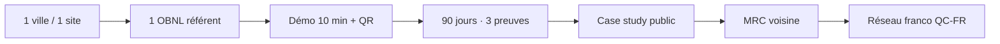

# Plan d'affaires — CirculAI  
## Pilote territorial · économie circulaire francophone

| | |
|---|---|
| **Document** | Plan d'affaires régional — version pilote |
| **Horizon stratégique** | 12 mois (phase 1 : 90 jours) |
| **Territoire cible (exemple)** | Ville de Québec — *remplacer `[TERRITOIRE]` pour autre municipalité* |
| **Produit présenté aux décideurs** | **CirculAI** uniquement |
| **Hors périmètre contractuel type** | Egor69 (jumeau numérique · divertissement / culture) |
| **Statut** | Document de travail fondateur — mai 2026 |
| **Confidentialité** | Usage municipal, OBNL, investisseurs alignés — pas de diffusion de métriques non vérifiées |

---

## Synthèse exécutive

**CirculAI** est une plateforme numérique **québécoise**, en **français**, qui relie sur un même hub l’**économie circulaire** locale (don, troc, réparation), un **atlas de savoirs**, le portail **Nature Québec**, et un **cadre de pilote 90 jours** assorti de **trois preuves documentées** — sans promesses marketing ni métriques inventées.

**Problème adressé :** les acteurs territoriaux (municipalités, OBNL, commerces, citoyens) dispersent leurs outils et leurs données ; les projets circulaires et culturels peinent à **se voir**, à **se mesurer** et à **convaincre** sans budget « géant du web ».

**Solution :** un prototype **déjà en ligne** (`egor69.ca`) : parcours démo en 10 minutes, pilote cadré sur **un seul site**, rapport d’une page et checklist **/docs/preuves**.

**Demande au territoire (phase 1) :** lettre d’appui ou de mise en relation, désignation d’un **partenaire OBNL référent**, et éventuellement un **enveloppe pilote** de `[5 000 – 25 000 $ CAD]` — pas un déploiement ERP intégral.

**Vision 12 mois :** une **preuve territoriale publiable** (case study), 50–200 utilisateurs réels sur le pilote, et une base pour extension MRC / partenaires franco-québécois — **après** validation des faits, pas avant.

---

## 1. Contexte et opportunité

### 1.1 Macro-tendances (pertinentes, non exhaustives)

- **Économie circulaire** : pression réglementaire et citoyenne sur le gaspillage, la réparation et l’achat local.  
- **Souveraineté numérique francophone** : dépendance aux plateformes US ; besoin d’outils **compris en français** et ancrés localement.  
- **ESS et municipalités** : attente de **preuves d’impact** mesurables pour subventions et communication.  
- **Tourisme & patrimoine (Québec)** : fort potentiel de liens **culture · nature · territoire** sans confondre fiction et promesse de service public.

### 1.2 Territoire pilote — Ville de Québec (fiche factuelle)

*Sources : articles Wikipédia consultés mai 2026 — valider tout engagement officiel auprès de [ville.quebec.qc.ca](https://www.ville.quebec.qc.ca).*

| Indicateur | Donnée documentée |
|------------|-------------------|
| Statut | Capitale nationale du Québec ; « ville et territoire équivalent » |
| Population (ville) | ~549 000 (2021) ; ~574 000 (2024, infobox) |
| Agglomération | ~839 000 (2021) |
| Patrimoine | Vieux-Québec — UNESCO (1985) |
| Atouts économiques cités | Biotech, tourisme, sciences de la vie, technologies appliquées |
| Pertinence CirculAI | Concentration institutionnelle, OBNL, culture, commerces — **un** site pilote suffit pour 90 j |

**Pourquoi commencer ici :** effet de **capitale** (visibilité), écosystème communautaire dense, et alignement avec une stratégie **régionale d’abord** avant expansion nationale ou internationale.

### 1.3 Interlocuteur municipal (contexte — sans engagement)

*Bruno Marchand, maire depuis novembre 2021 — trajectoire documentée en organisateur communautaire et direction Centraide (2014–2021).*

**Implication pour CirculAI :** privilégier un pitch **terrain / OBNL / bibliothèque / repair café**, introduit par un partenaire de confiance — pas un dossier « smart city » générique en cold call.

**Relais cabinet suggérés :** culture · développement économique · vie communautaire · bibliothèques · environnement.

### 1.4 Écosystème numérique québécois (contexte — pas partenariat)

*CirculAI **n’entretient aucun** partenariat, commandite, investissement ni accord commercial avec les organisations ci-dessous. Ces mentions situent le territoire — **pas** un endossement institutionnel.*

#### Hydro-Québec ([Wikipédia](https://fr.wikipedia.org/wiki/Hydro-Qu%C3%A9bec))

- Société d’État québécoise (1944) ; actionnaire unique : gouvernement du Québec.
- Mandat public : production, transport et distribution d’électricité ; rôle historique dans l’électrification et le développement économique provincial.
- **Usage ici :** langage de sobriété, réparation et service public — **sans** alléguer qu’Hydro-Québec finance ou intègre CirculAI.

#### Investissement Québec ([Wikipédia](https://fr.wikipedia.org/wiki/Investissement_Qu%C3%A9bec))

- Société d’État (1998) ; siège à Québec (ville) ; mandat de développement économique et de financement d’entreprises (prêts, capital, accompagnement selon programmes).
- **Usage ici :** canal **postérieur** aux 3 preuves du pilote (recherche de programmes) — **aucune relation existante** avec CirculAI.

#### Vidéotron ([Wikipédia](https://fr.wikipedia.org/wiki/Vid%C3%A9otron))

- **Vidéotron S.E.N.C.** : l’une des principales compagnies de **télécommunications** du Canada ; fondée en **1964** (André Chagnon).
- Filiale de **Québecor Média** ; siège à **Montréal** ; effectif documenté **+6 000** (infobox Wikipédia).
- Activités : câblodistribution, **Internet**, téléphonie par câble et **sans fil** sur la plupart des marchés résidentiels et commerciaux du **Québec** (et certains villages de l’Ontario).
- Principal concurrent cité : **Bell Canada** (services résidentiels et commerciaux au Québec).
- Repères : fournisseur d’accès Internet depuis les années 1990 ; rachat par Québecor en **2000**.

**Usage ici (pilote bibliothèque / citoyen) :** l’**inclusion numérique** suppose un accès Internet **documenté localement** (Wi‑Fi public, prêt de tablettes, sondage) — alignement thématique avec un pilote municipal, **sans** intégration technique ni commandite d’un opérateur télécom. CirculAI ne remplace pas un FAI.

**Sources Wikipédia (consultées mai 2026) :** [Hydro-Québec](https://fr.wikipedia.org/wiki/Hydro-Qu%C3%A9bec) · [Investissement Québec](https://fr.wikipedia.org/wiki/Investissement_Qu%C3%A9bec) · [Vidéotron](https://fr.wikipedia.org/wiki/Vid%C3%A9otron)

---

## 2. Proposition de valeur

### 2.1 Pour chaque partie prenante

| Partie | Douleur | Apport CirculAI |
|--------|---------|-----------------|
| **Municipalité** | Risque politique des gros projets IT ; manque de preuves rapides | Pilote **90 j · 1 site · 3 preuves** ; démo 10 min |
| **OBNL / communautaire** | Visibilité faible, formulaires dispersés | Vitrine + portail Nature QC + liens atlas |
| **Commerces / repair** | Découverte locale difficile | Marketplace (annonces pilotes réelles) |
| **Citoyens** | Outils anglophones ou complexes | Parcours FR, gratuit ou low-cost |
| **Investisseur / subvention** | Greenwashing | Charpente **8 promesses** + page **preuves vérifiables** |

### 2.2 Différenciation durable

CirculAI n’est pas :

- un clone SaaS californien traduit ;  
- un jeu vidéo vendu comme solution municipale ;  
- une promesse « IA qui remplace l’humain » sur le juridique ou la santé.

CirculAI **est** :

- un **assemblage** circulaire + territoire + français + preuves ;  
- un produit **démontrable aujourd’hui** (modules listés section 7) ;  
- une marque **B2B / territorial** distincte du divertissement (Egor69).

---

## 3. Architecture produit : CirculAI vs Egor69

| Dimension | **CirculAI** | **Egor69** |
|-----------|--------------|------------|
| **Mission** | Efficacité territoriale, pilote, mesure | Culture, exploration, attachement public |
| **Pitch mairie / subvention** | **Oui** | **Non** (mention optionnelle en clôture démo) |
| **URLs clés** | `/entreprises`, `/pilote`, `/portail/nature-quebec`, `/marketplace`, `/docs/preuves` | `/world`, `/boutique`, encyclopédie |
| **Revenus prioritaires** | Pilote B2B, kits, subvention | PDF, passes, contenu numérique |

**Règle d’or commerciale :** tout dossier municipal ou investisseur institutionnel = **kit CirculAI** (`/docs/circulai-kit-regional`) **sans** obligation de présenter le Verse 3D.

---

## 4. Offre pilote — 90 jours (cœur du modèle)

### 4.1 Principes de cadrage

1. **Un seul site** ou un seul programme (pas toute la ville).  
2. **Trois preuves** obligatoires en fin de pilote (section 4.4).  
3. **Rapport final** : 1 page + annexes factuelles.  
4. **Transparence** : distinction « disponible aujourd’hui » vs « projection » (aligné `/entreprises`).

### 4.2 Scénarios de périmètre (choisir un)

| Scénario | Site pilote | Modules activés | Indicateur principal |
|----------|-------------|-----------------|----------------------|
| **A — Nature & territoire** | Parc / espace vert partenaire | Portail Nature QC + 1 quête | Participations / fiches créées |
| **B — Économie circulaire** | Repair café ou marché | Marketplace + 3 annonces réelles | Transactions / contacts générés |
| **C — Culture & savoir** | Bibliothèque / MJC | Atlas + atelier + formulaire | Inscriptions atelier |
| **D — ESS hybride** | OBNL référent multi-usages | Combinaison légère A+B | Temps admin économisé |

### 4.3 Calendrier type

| Phase | Semaines | Livrables |
|-------|----------|-----------|
| **Cadrage** | 1–2 | Charte pilote signée · partenaire référent · formation 1 h |
| **Activation** | 3–4 | Mise en ligne contenu réel · communication locale (QR `/pilote`) |
| **Usage** | 5–8 | Objectif **30–100 interactions** qualifiées (pas 10 000 vues vides) |
| **Mesure** | 9–10 | Collecte preuves · témoignages consentis |
| **Clôture** | 11–12 | Rapport 1 page · décision : extension / arrêt / autre site |

### 4.4 Les trois preuves (non négociables)

| # | Type | Exemple mesurable | Source |
|---|------|-------------------|--------|
| 1 | **Temps** | Heures admin économisées sur un processus (inscription, liste) | Feuille temps partenaire |
| 2 | **Participation** | Nombre d’actions réelles (inscriptions, dépôts, visites qualifiées) | Analytics ou registre |
| 3 | **Témoignage** | Citation signée d’un acteur local | PDF / courriel archivé |

*Aucun chiffre projeté dans ce plan ne remplace ces preuves une fois le pilote lancé.*

---

## 5. Modèle d'affaires

### 5.1 Sources de revenus (horizon 12 mois)

| Source | Phase | Fourchette indicative (CAD) | Conditions |
|--------|-------|------------------------------|------------|
| **Pilote municipal / OBNL** | 0–90 j | 0 – 25 000 $ | Après démo ; périmètre signé |
| **Pilote entreprise** | 3–12 mois | Sur devis | `/pilote` — PME, coop |
| **Kits numériques** | Continu | 12 – 29 $ / unité | Boutique — encyclopédie, Nature QC, codex |
| **Abonnement explorateur** | Continu | 44 $ / mois | `/pricing` — individus |
| **Subventions** | 6–12 mois | Variable | Après case study |
| **Pack fondateur** | Liste d’attente | 89 $+ | Early supporters — manuel |

### 5.2 Structure de coûts (ordre de grandeur, année 1)

| Poste | Mensuel estimé | Notes |
|-------|----------------|-------|
| Hébergement & domaine | 50 – 150 $ | Vercel, DNS |
| Outils (email, analytics) | 0 – 80 $ | Selon stack |
| Temps fondateur | Opportunité | Principal « coût » phase 1 |
| Stripe / paiements | % transaction | Si boutique activée |
| Légal / comptabilité | Ponctuel | Incorporation, contrats pilote |

**Seuil de viabilité réaliste année 1 :** couvrir l’infra + **1 pilote payant** ou équivalent subvention — pas EBITDA positif sur marque nationale.

### 5.3 Projections financières prudentes (scénario base)

*Hypothèses explicites — à recalculer après pilote.*

| Trimestre | Revenus | Dépenses cash | Résultat |
|-----------|---------|---------------|----------|
| T1 | 0 – 5 000 $ | 1 500 $ | Investissement fondateur |
| T2 | 5 000 – 15 000 $ | 2 000 $ | Pilote + boutique early |
| T3 | 10 000 – 25 000 $ | 3 000 $ | Extension 2e territoire |
| T4 | 15 000 – 40 000 $ | 4 000 $ | Consolidation |

**Plafond année 1 (scénario prudent) :** 40 000 – 85 000 $ revenus — **sans** garantie ; dépend entièrement de signatures réelles.

---

## 6. Stratégie go-to-market (régional → domino)

### 6.1 Séquence recommandée

### 6.2 Canaux tactiques

| Canal | Action | KPI |
|-------|--------|-----|
| **Introduction chaude** | OBNL → cabinet municipal | 1 rencontre qualifiée |
| **Événement local** | Kiosque + tablette `/pilote` | 20+ scans QR |
| **Presse / radio FR** | Histoire territoire + circulaire | 1 mention |
| **Réseau investisseur** | Codex investisseur + preuves | 3 meetings |
| **Boutique** | Soutien citoyen 12–29 $ | Panier moyen réel |

### 6.3 Québec – France (phase 2, post-preuve)

- Offices franco-québécois, jumelages, programmes **numérique / culture** — **après** publication du case study Québec.  
- Message : *outil francophone exportable*, pas « conquête anti-US » en salle de conseil.

---

## 7. Opérations & technologie (vérité produit)

### 7.1 Déjà en production (démo live)

| Module | Route | Statut |
|--------|-------|--------|
| Accueil & navigation | `/` | Live |
| Marketplace | `/marketplace` | Démo — annonces pilotes à peupler |
| Portail Nature Québec | `/portail/nature-quebec` | Live |
| Pilote 90 j | `/pilote` | Live |
| Entreprises | `/entreprises` | Live |
| Preuves | `/docs/preuves` | Live |
| Boutique numérique | `/boutique` | Live |
| Kit régional | `/docs/circulai-kit-regional` | Live |

### 7.2 Après accord pilote (sur devis)

- Stripe production + allowlist prix  
- CRM / exports ESG  
- Intégrations ERP (entreprises uniquement)  
- Domaine dédié `circulai.com` (optionnel)

### 7.3 Sécurité & données (engagements)

- HTTPS en production ; pas de vente de données citoyennes.  
- Distinction démo / production documentée.  
- Pas de conseil juridique ou médical automatisé.

---

## 8. Analyse des risques

| Risque | Probabilité | Impact | Mitigation |
|--------|-------------|--------|------------|
| Scope trop large | Élevée | Échec pilote | 1 site · 90 j · 3 preuves |
| Confusion CirculAI / Egor | Moyenne | Perte crédibilité | Kit mairie = CirculAI seul |
| Allégation de commandite (HQ, IQ, télécom) | Moyenne | Rejet institutionnel | Section 1.4 = contexte uniquement |
| Fondateur solo burnout | Élevée | Retard | Délégation OBNL · parcours minimal |
| Promesses excessives | Moyenne | Rejet institutionnel | Charpente 8 promesses · pas de métriques fictives |
| Dépendance subvention | Moyenne | Trésorerie | Boutique + B2B petits contrats |
| Concurrence SaaS | Faible | Pression prix | Différenciation territoire + FR |

---

## 9. Équipe & gouvernance

| Rôle | Statut actuel | Besoin phase 2 |
|------|---------------|----------------|
| **Fondateur·rice** | Produit, tech, relation terrain | Maintenir |
| **Partenaire OBNL** | À recruter par pilote | Référent terrain |
| **Conseil municipal** | À engager | Lettre d’appui |
| **Comptable / juriste** | Ponctuel | Contrats pilote |

**Gouvernance éthique :** documentation publique des limites produit ; révisions du plan après chaque pilote.

---

## 10. Demande & prochaines étapes

### 10.1 Ce que nous demandons (territoire pilote)

- [ ] Rencontre **15 minutes** (cabinet ou OBNL hôte)  
- [ ] Désignation d’**un site pilote** (scénario A, B, C ou D)  
- [ ] **Lettre d’appui** ou courriel de mise en relation (non budgétaire acceptable en phase 0)  
- [ ] Option : enveloppe pilote `[montant]` pour accompagnement 90 jours  

### 10.2 Actions fondateur — 7 jours

- [ ] Personnaliser la **lettre municipale** (`lettre-pilote-municipal.md`)  
- [ ] Répéter la **démo 10 min** (`plan-demonstration-10min.md`)  
- [ ] Imprimer QR → `/docs/circulai-kit-regional`  
- [ ] Identifier 3 OBNL pour introduction  
- [ ] Mettre à jour ce plan avec le territoire signé  

### 10.3 Documents du kit (même dossier)

| Document | Usage |
|----------|--------|
| Lettre pilote municipal | Premier contact écrit |
| Plan de démonstration 10 min | Rendez-vous live |
| Plan d’action Québec 2026 | Jalons trimestriels · `/docs/circulai/plan-action-quebec` |
| **Ce plan d’affaires** | Cabinet, investisseur, subvention |

---

## Annexe A — Indicateurs année 1 (cibles réalistes)

| Indicateur | Cible |
|------------|-------|
| Pilotes territoriaux signés ou appuyés par écrit | **1** |
| Preuves publiables (consentement) | **3** |
| Utilisateurs réels cumulés (pilote) | **50 – 200** |
| Partenaires listés (non fictifs) | **5 – 15** |
| Revenus cash | **40 – 85 k$** (scénario prudent) |

---

## Annexe B — Chiffres économie & environnement (sources publiques)

| Indicateur | Valeur | Source |
|------------|--------|--------|
| Indice de circularité QC | **2,5 %** (2023) | [ISQ — circularité](https://statistique.quebec.ca/vitrine/developpement-durable/strategie-2023-2028/economie-verte-et-responsable/circularite-matieres) |
| Déchets éliminés | **685 kg / hab.** (2023) | [RECYC-QUÉBEC — Bilan GMR](https://www.recyc-quebec.gouv.qc.ca/actualite/recyc-quebec-diffuse-les-resultats-du-bilan-2023-de-la-gestion-des-matieres-residuelles-au-quebec-bilan-gmr/) |
| Entreprises avec pratiques EC | **~82 %** / **~69 %** hors recyclage seul | [ISQ — économie circulaire](https://statistique.quebec.ca/fr/document/economie-circulaire) |

**Document détaillé :** [Valeur économie & environnement](/docs/circulai/valeur-economie-environnement)

---

## Annexe C — Main-d’œuvre fondateur (40 jours solo)

| Mesure | Valeur |
|--------|--------|
| Lignes code `src` | ~61 000 |
| Équivalent heures équipe | 420 – 670 h |
| Fourchette marché CAD (estimation) | **35 700 – 130 000 $** |

**Document détaillé :** [Main-d’œuvre 40 jours](/docs/circulai/main-oeuvre) — *non audité, méthodologie transparente.*

---

## Annexe D — Partenaires (fondateur = code & vision)

Liste OBNL, municipal, finance : **[Partenaires à approcher](/docs/circulai/partenaires)**

---

## Annexe E — Artifacts Copilot ↔ dépôt

Vos 5 liens Microsoft Copilot sont mappés aux documents versionnés : **[Artifacts Copilot](/docs/circulai/artifacts-copilot)**

---

## Annexe F — Glossaire

- **CirculAI :** marque intelligence circulaire · territoire · preuves.  
- **Egor69 :** jumeau numérique · Verse · encyclopédie · divertissement.  
- **Preuve :** fait vérifiable documenté — pas une projection slide.  
- **Pilote 90 j :** engagement limité dans le temps et dans le périmètre.

---

*CirculAI — plan d’affaires régional v2.0 · Mettre à jour après chaque pilote signé.*  
*Contact : voir `/entreprises` · Kit : `/docs/circulai-kit-regional`*
