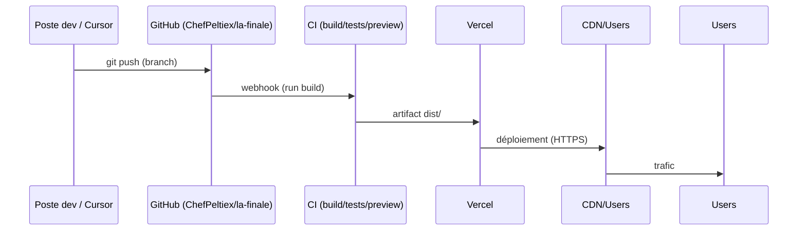
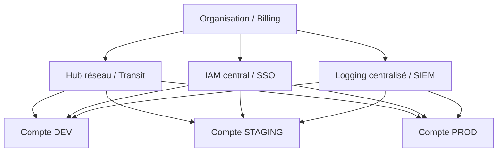

### final-pack.md (Markdown prêt à coller dans GitHub)

```markdown
# CirculAI — Executive pack

---

## CirculAI — Executive one‑page brief

### Pitch (≈90 s)
Il y a quelques semaines, j’ai repris mon espace au sens propre — ranger, nettoyer, rendre l’environnement lisible. J’ai fait pareil avec mon travail : transformer une intuition en système. **CirculAI** répond à un problème concret : la circularité se discute beaucoup mais manque de livrables traçables. Aujourd’hui je montre un circuit réel : un site déployé, une encyclopédie visuelle en PDF, un dépôt GitHub avec commits ciblés, et une méthode **SCALE** — délégation contrôlée, revue humaine, reproductibilité. Ce n’est pas une promesse cosmique : c’est une démonstration. Je demande un **pilote 90 jours** mesuré sur trois métriques : **temps, coût, qualité des données**.

### Points clés
- **Objectif pilote** : valider reproductibilité et valeur métier sur un périmètre restreint.  
- **Livrables** : URL publique, PDF encyclopédie, dépôt GitHub avec commits traçables, diagrammes infra.  
- **Méthode SCALE** : délégation contrôlée; revue humaine; pipelines reproductibles.  
- **Sécurité & gouvernance** : IAM minimal, logging centralisé, pas de secrets dans le repo.  
- **Durabilité** : checklist P691 (à confirmer) pour mesurer empreinte et optimiser builds.

---

## Dossier preuves (annexe pour le pupitre)
- **Site** : `https://circulai-copy.vercel.app` — vérifier **Root Directory = peltiez** dans Vercel.  
- **Deep links / SPA** : commit **4478e7d** (`vercel.json` → rewrite `/index.html`).  
- **PDF encyclopédie** : `peltiez/public/encyclopedie.pdf` (assemblage depuis `assets/codex-encyclopedie/`).  
- **Assets** : `assets/codex-encyclopedie/` (jeu d’images versionné).  
- **Docs gouvernance** : `peltiez/docs/codex-pdf-blueprint.md`, `peltiez/docs/codex-pdf-assembly.md`, `RELEASE_NOTES_v1.0.md`.  
- **Fiche exécutive** : `peltiez/docs/scale-ai-fiche-1-page.md` (vérifier dernier commit sur `origin/master`).  

**Commandes preuves rapides**
```bash
git fetch origin
git log -n 5 --pretty=oneline
git ls-tree -r origin/master --name-only | grep -E "^peltiez/(docs|diagrams)/"
curl -I https://circulai-copy.vercel.app/
curl -I https://circulai-copy.vercel.app/marketplace
```

---

## Plan d’adressage IP (template RFC1918)
| Zone / VLAN | CIDR proposé | Usage typique | Passerelle | Remarques |
|---|---:|---|---:|---|
| Management | `10.0.0.0/26` | Bastion, jump hosts, outils admin | `10.0.0.1` | Accès restreint, MFA |
| Serveurs internes | `10.0.1.0/24` | APIs, workers, services | `10.0.1.1` | Segmentation par NSG/SG |
| Bases de données | `10.0.2.0/24` | DB cluster (privé) | `10.0.2.1` | Pas d’accès Internet direct |
| Postes / Wi‑Fi | `10.0.10.0/22` | Laptops, postes utilisateurs | `10.0.10.1` | Filtrage sortant |
| IoT / invités | `10.0.20.0/24` | IoT, invités isolés | `10.0.20.1` | ACL strictes |

**Recommandations** : réserver blocs pour élasticité (K8s pods/containers : /23 par env si besoin). NAT centralisé pour sortie Internet ; LB public pour entrées nécessaires. Flow logs activés pour subnets critiques.

---

## P691 — Checklist opérationnelle (version générique)
**Avertissement** : référence P691 non fournie. Fournis le PDF/nom complet pour alignement normatif exact.

**Objectif** : minimiser empreinte, favoriser réutilisation d’assets, garantir transparence et audits réguliers.

**Contrôles recommandés**
- Mesure consommation des builds (estimation kWh par pipeline).  
- Optimisation builds : cache, builds incrémentaux, suppression d’artefacts inutiles.  
- Archivage : politique de rétention (tagging + lifecycle).  
- Réutilisation : centraliser assets versionnés (object store).  
- Reporting mensuel d’impact (consommation, stockage, réutilisation).  
- Revue trimestrielle des logs et accès.  
- Tagging obligatoire : environnement, propriétaire, centre de coût, sensibilité.  
- Sécurité : chiffrement at‑rest/in‑transit, rotation secrets, least privilege IAM.  
- Accessibilité : vérifier conformité basique des PDF.

**Livrables suggérés**
- `peltiez/docs/P691-evidence/consumption-report-YYYY-MM.md`  
- Checklist d’audit signée  
- Script d’estimation d’empreinte build (CI job)

---

## Diagrammes (Mermaid — coller dans Confluence / Mermaid live / Draw.io)
### Infra — vue d’ensemble
```mermaid
flowchart LR
  subgraph Edge
    Users[Utilisateurs / Navigateurs]
    CDN[CDN / TLS / WAF]
  end

  subgraph Frontend
    SPA[Frontend SPA (Vite)]
  end

  subgraph Backend
    API[API serverless / Functions]
    DB[Base de données (optionnelle)]
    OBJ[Stockage objet (PDF / assets)]
  end

  subgraph Dev
    GH[GitHub repo / PR / commits]
    CI[CI/CD build / preview]
    Vercel[Vercel build & deploy]
  end

  Users -->|HTTPS| CDN --> SPA
  SPA -->|API calls| API
  API --> DB
  SPA --> OBJ
  GH --> CI -->|webhook| Vercel
  CI -->|artifacts| OBJ
  Vercel --> CDN
```

### Déploiement GitHub → Vercel (séquence)


### Landing Zone — haut niveau


### Flux de données CirculAI
```mermaid
flowchart LR
  User[Utilisateur] -->|interaction| SPA
  SPA -->|ingest| Ingest[Validation / Normalisation]
  Ingest --> ETL[Jobs ETL / Enrichissement IA]
  ETL --> Master[Master dataset (versionné)]
  Master --> PDF[PDF encyclopédie (peltiez/public/encyclopedie.pdf)]
  Master --> API
  API --> SPA
  ETL -->|logs| Audit[Journalisation / commits]
  Audit --> GitHub
```

---

## Checklist finale avant présentation (à valider maintenant)
- [ ] `curl -I https://circulai-copy.vercel.app/` → **200 OK**  
- [ ] `curl -I https://circulai-copy.vercel.app/marketplace` → **200 OK**  
- [ ] `peltiez/public/encyclopedie.pdf` s’ouvre localement  
- [ ] `git log -n 5 --pretty=oneline` (captures pour pupitre)  
- [ ] Capture écran du build Vercel montrant le commit lié  
- [ ] `git grep -nE "AWS_SECRET|PRIVATE_KEY|password|SECRET|TOKEN"` → rien de sensible

---

## Conclusion & demande
Je demande l’autorisation d’un **pilote 90 jours** sur un périmètre défini, avec reporting hebdomadaire sur **temps, coût, qualité des données**. Objectif : démontrer reproductibilité, valeur métier et préparer montée en charge.

---

## Fichiers inclus (références dans le repo)
- `peltiez/docs/proofs.md`  
- `peltiez/docs/scale-ai-fiche-1-page.md`  
- `peltiez/docs/network-ip-plan.md`  
- `peltiez/docs/P691-checklist.md`  
- `peltiez/diagrams/infra.mmd`  
- `peltiez/public/encyclopedie.pdf` (vérifier présence)

```

**Instructions rapides** : crée un fichier `peltiez/docs/final-pack.md` dans GitHub (ou dans ton éditeur local), colle ce bloc, commit, puis exporte en PDF via VS Code (Markdown PDF) ou GitHub → Raw → télécharger et convertir via Google Docs / pandoc.
