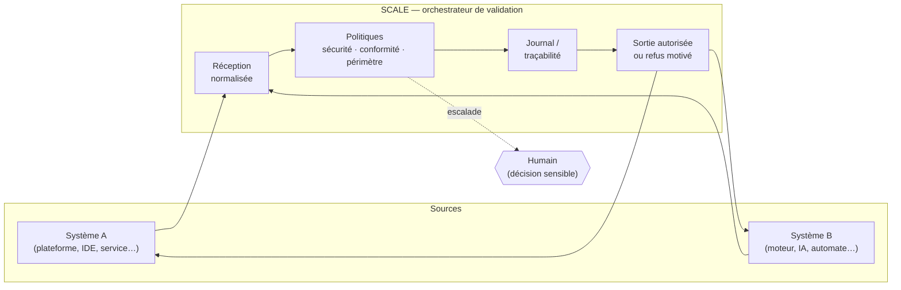
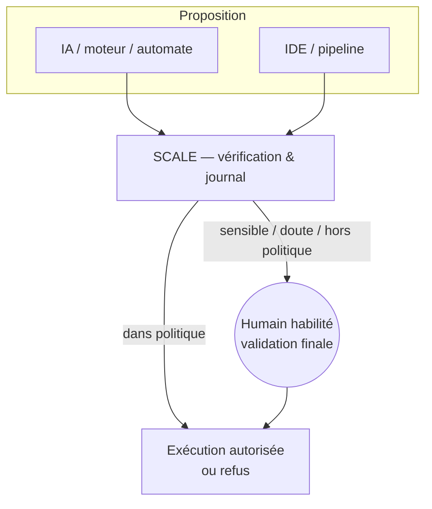

# Pont de cohérence inter-systèmes (SCALE)

**Protocole SCALE — version documentaire v1.0** (aligné [`PROJECT_GENESIS.md`](../../PROJECT_GENESIS.md) §4). Toute révision majeure : mettre à jour ce fichier + la genèse + [`CHANGELOG.md`](../../CHANGELOG.md).

- **Contrat opérationnel v1.1** (états, sévérités, codes, journaux, escalade) : [`scale-protocol-v1.1.md`](scale-protocol-v1.1.md).

**Langue par défaut : français** — les sections anglaises reprennent le même contenu.

Ce document est le **kit conceptuel** exportable (plateforme, UI, pitch, doc technique, schémas). Il complète la section **« Pont de cohérence inter-systèmes (protocole SCALE) »** du fichier racine [`PROJECT_GENESIS.md`](../../PROJECT_GENESIS.md).

**Gouvernance & CI (monorepo `la finale/`)** : [`CONTRIBUTING.md`](../../CONTRIBUTING.md) (tableau CI), [`SECURITY.md`](../../SECURITY.md), [`.github/workflows/ci.yml`](../../.github/workflows/ci.yml) (`igor-verify`), [`.github/workflows/nightly.yml`](../../.github/workflows/nightly.yml), [`.github/workflows/codex-usb-nightly.yml`](../../.github/workflows/codex-usb-nightly.yml), [`.github/workflows/release.yml`](../../.github/workflows/release.yml), [`CHANGELOG.md`](../../CHANGELOG.md).

- **Charte multi-agents EGOR (principes, non contractuelle)** : [`EGOR-charte-cooperation-multi-agents.md`](EGOR-charte-cooperation-multi-agents.md) — intentions de coopération supervisée et limites d’auto-autorisation ; complément au kit SCALE ci-dessous.

---

## Encart plateforme — autorité (FR)

> **L’humain est le valideur autorisé sur le sensible.**  
> L’IA peut proposer. L’outil peut exécuter dans le périmètre autorisé. Sans cette règle, le système dérape ; avec elle, il reste **traçable, responsable et gouvernable**.

## Encart plateforme — authority (EN)

> **Humans are the authorized validators for sensitive decisions.**  
> AI may propose. Tools may execute within policy. Without this rule, systems drift; with it, they stay **traceable, accountable, and governable**.

---

## Diagramme (Mermaid)



### Human-in-the-loop (autorité explicite)



**Multi-agents (permis / pas permis).** *Les agents peuvent se coordonner pour proposer ; ils ne doivent pas s’octroyer la décision finale sur les effets sensibles.*  
Les cadres visent surtout les effets sur le monde sans contrôle humain clair, pas chaque message inter-services.  
*Agents may coordinate to propose; they must not grant themselves the final decision on sensitive effects.*  
Norme détaillée (diagramme, nuances) : [`scale-protocol-v1.1.md#scale-multi-agent-model`](scale-protocol-v1.1.md#scale-multi-agent-model).

---

## Schéma ASCII (légende slide)

```
  Système A ──┐
              ├──▶ [ SCALE ] ──▶ journal + politiques ──▶ sortie / refus
  Système B ──┘         │
                        └──▶ humain = valideur autorisé (sensible, exception, merge)
```

---

## Français

### Bloc plateforme (autonome)

**Pont de cohérence inter-systèmes (SCALE)**  
Quand deux systèmes (ex. plateforme + moteur, ou IDE + IA) échangent sans médiation, on obtient du bruit et peu de traçabilité. Le **chaînon** indispensable est un **orchestrateur de validation** : il reçoit les flux, applique règles de conformité et de sécurité, journalise, et ne renvoie que des réponses **validées** ou des refus **explicites**. C’est ce qui transforme une intégration en **écosystème fiable**. Sur EGOR, ce rôle peut être porté par un **module SCALE** qui arbitre entre actions humaines, IA et automates — sans remplacer la décision humaine sur les sujets sensibles, mais **en l’encadrant et en la préparant**.

### Tooltip (~120 caractères)

`SCALE : valide et journalise les flux humains, IA et outils — cohérence sans remplacer le jugement humain sur le sensible.`

### Pitch (2 phrases)

Deux systèmes sans médiation produisent du bruit ; avec un orchestrateur de validation, ils produisent de la confiance et de la traçabilité. **SCALE** est ce chaînon : il arbitre, vérifie et journalise — la décision finale sur le sensible reste humaine.

### Documentation technique (formelle)

**Objet.** Définir le rôle du **pont de cohérence inter-systèmes** (projet **SCALE**) dans l’architecture EGOR.  
**Constat.** Les interactions directes entre composants autonomes (services, agents, IDE) augmentent le risque d’incohérence sémantique, d’actions non autorisées et de défaut de traçabilité.  
**Mécanisme.** Un composant d’**orchestration et de validation** interpose : (1) réception normalisée des requêtes ou sorties, (2) vérification contre les politiques de sécurité et de conformité produit, (3) journalisation des décisions, (4) émission de réponses validées ou de rejets documentés, (5) **escalade obligatoire vers un humain habilité** pour tout ce qui est « sensible » au sens politique ou sécurité.  
**Périmètre.** Le module ne substitue pas aux humains la responsabilité des arbitrages légaux, éthiques ou métier à fort risque ; il **matérialise** les garde-fous et laisse la décision explicite aux rôles compétents.  
**Implémentation de référence (dépôt).** Les mêmes principes sont partiellement matérialisés par la chaîne qualité (`npm run verify` dans `peltiez/`), la CI **`igor-verify`**, la politique de sécurité, la gouvernance des contributions, les jobs planifiés et le pipeline de release sur tags `v*`.

### Texte pour schéma (speaker notes)

`Système A` et `Système B` n’échangent **pas** en direct vers l’effet produit. Les deux passent par **SCALE** : **entrée** → **politiques** (sécurité, conformité, périmètre) → **journal** → **sortie autorisée** ou **refus motivé**. Les humains conservent la **décision** sur les cas sensibles ; SCALE porte la **régularité** du flux.

---

## English

### Platform block (standalone)

**Inter-system coherence bridge (SCALE)**  
When two systems (e.g. platform and engine, or IDE and AI) exchange data without mediation, the result is noise and weak traceability. The missing link is a **validation orchestrator**: it ingests flows, applies compliance and security rules, records outcomes, and returns only **validated** responses or **explicit** denials. That turns integration into a **reliable ecosystem**. On EGOR, this role can be embodied by a **SCALE module** that arbitrates among human actions, AI, and automation—**framing and preparing** human decisions on sensitive matters, **not replacing** them.

### Tooltip (~120 characters)

`SCALE validates & logs human↔AI↔tool flows so systems stay coherent—not a substitute for human judgment on sensitive decisions.`

### Pitch (two sentences)

Two systems without mediation create noise; with a validation orchestrator, they create trust and traceability. **SCALE** is that link: it arbitrates, checks, and logs—while sensitive judgment stays with people.

### Technical documentation (formal)

**Purpose.** Define the **inter-system coherence bridge** (**SCALE**) in the EGOR architecture.  
**Issue.** Direct exchanges between autonomous components raise risks of semantic drift, unauthorized actions, and poor traceability.  
**Mechanism.** A validation **orchestrator** enforces: (1) normalized intake, (2) policy and security checks, (3) decision logging, (4) validated outputs or documented denials, (5) **mandatory escalation to an authorized human** for anything “sensitive” under policy or security.  
**Scope.** It does not replace humans for high-risk legal, ethical, or business judgment; it **enforces guardrails** and routes explicit decisions to accountable roles.  
**Reference implementation (repository).** The same principles are partially embodied by `npm run verify` (in `peltiez/`), the **`igor-verify`** CI workflow, security policy, contribution governance, scheduled jobs, and the `v*` release pipeline.

### Diagram companion (speaker notes)

Systems **A** and **B** do not drive outcomes by direct coupling. Both go through **SCALE**: **intake** → **policy checks** (security, compliance, scope) → **audit log** → **authorized output** or **documented denial**. Humans retain **judgment** on sensitive cases; SCALE enforces **flow regularity**.

---

*CirculAI Québec Inc. — aligné avec la licence du monorepo (voir [`LICENSE`](../../LICENSE)).*
