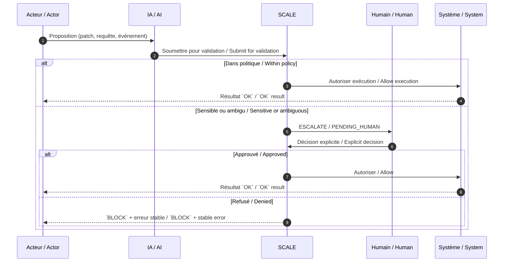

# SCALE protocol v1.1 — operational contract

**Status:** *draft-stable*  
**Scope:** Operational layer extending **SCALE v1.0** (narrative + kit remain authoritative for intent; **v1.1** norme les états, sévérités, codes et journaux pour implémentations process / CLI / hooks).

**Cross-links**

- Constitution & pont v1.0 : [`../../PROJECT_GENESIS.md`](../../PROJECT_GENESIS.md) §4 (protocole SCALE, règle d’or).
- Kit narratif v1.0 (Mermaid, encarts, bilingue) : [`scale-bridge.md`](scale-bridge.md).
- Sécurité & divulgation : [`../../SECURITY.md`](../../SECURITY.md).
- Contribution & CI : [`../../CONTRIBUTING.md`](../../CONTRIBUTING.md).

**Versioning note** — La narration **v1.0** reste dans [`scale-bridge.md`](scale-bridge.md). **v1.1** est le **contrat opérationnel** (états, sévérités, codes, logs, escalade) pour aligner services, pipelines et outillage sans réécrire le pitch produit.

---

## Invariant (FR)

> **L’humain est le valideur autorisé sur le sensible.**  
> L’IA peut proposer. L’outil peut exécuter dans le périmètre autorisé. Ni l’IA ni le pipeline ne remplacent cette autorité — ce qui limite dérive, automatisations abusives et erreurs irréversibles.

*(Même règle que la « pierre angulaire » dans [`PROJECT_GENESIS.md`](../../PROJECT_GENESIS.md) §4.)*

## Invariant (EN)

> **Humans are the authorized validators for sensitive paths.**  
> AI may propose. Tools may execute within policy. Neither AI nor pipelines replace that authority — limiting drift, abusive automation, and irreversible mistakes.

*(Same rule as the cornerstone in [`PROJECT_GENESIS.md`](../../PROJECT_GENESIS.md) §4.)*

---

## Tables de référence (bilingues) / Bilingual reference tables

Ces tableaux sont **normatifs** pour v1.1 ; ils ne sont pas dupliqués dans les sections langue ci-dessous.

### États du pont / Bridge states

| Code | Signification (FR) | Meaning (EN) | Étape typique suivante / Typical next step |
|------|----------------------|--------------|---------------------------------------------|
| `OK` | Requête conforme ; exécution ou poursuite autorisée dans le périmètre courant. | Request compliant; execution or continuation allowed within current scope. | Poursuivre le flux ; journaliser en `S0`–`S1` si anodin. / Continue flow; log at `S0`–`S1` if benign. |
| `WARN` | Conformité partielle, ambiguïté, contournement mineur ; pas de blocage dur mais signal fort. | Partial compliance, ambiguity, minor concern; no hard block but strong signal. | Corriger ou documenter ; surveiller ; éviter d’élargir le périmètre. / Fix or document; monitor; avoid widening scope. |
| `BLOCK` | Politique ou garde-fou refuse l’action ; arrêt sans escalade humaine obligatoire si le risque reste dans le cadre automatique. | Policy or safeguard denies the action; stop without mandatory human escalation if risk stays automatable. | Arrêt propre ; message d’erreur stable ; pas de mutation irréversible. / Clean stop; stable error; no irreversible mutation. |
| `ESCALATE` | Hors périmètre automatique ou risque élevé ; **escalade humaine requise** avant exécution. | Outside automatic scope or high risk; **human escalation required** before execution. | Passer en file d’attente humaine ; suspendre effets de bord ; tracer `request_id`. / Queue for human; suspend side effects; trace `request_id`. |
| `PENDING_HUMAN` | Décision déléguée ; aucune exécution sensible tant que l’humain habilité n’a pas statué. | Decision delegated; no sensitive execution until an authorized human decides. | Attendre validation explicite ; TTL / annulation documentée côté implémentation. / Await explicit validation; document TTL/cancel in implementation. |

### Niveaux de sévérité / Severity levels

| Code | Description (FR) | Description (EN) |
|------|------------------|------------------|
| `S0` | Informatif : bruit utile, métriques, succès sans enjeu. | Informational: useful noise, metrics, success with no material stake. |
| `S1` | Attention : comportement inattendu mineur, dette technique, contournement documenté. | Warning: minor unexpected behavior, tech debt, documented workaround. |
| `S2` | Majeur : non-conformité politique, risque données ou disponibilité, réversibilité coûteuse. | Major: policy non-compliance, data or availability risk, costly reversibility. |
| `S3` | Critique / **irréversible** : sécurité, légal, financier, PII, destruction de données ou d’infra. | Critical / **irreversible**: security, legal, financial, PII, destructive data or infra actions. |

### Codes de retour (process / CLI / hook) / Return codes

Les implémentations **peuvent** exposer entiers **ou** chaînes stables ; les deux colonnes « Code » ci-dessous sont équivalentes logiquement.

| Code (int) | Code (string) | État SCALE | Sévérité typique | Action |
|-------------:|---------------|------------|------------------|--------|
| `0` | `SCALE_OK` | `OK` | `S0` | Continuer ; journal minimal. / Continue; minimal log. |
| `10` | `SCALE_WARN` | `WARN` | `S1` | Retry possible après correction légère ; ne pas amplifier. / Retry after light fix; do not amplify. |
| `20` | `SCALE_BLOCK` | `BLOCK` | `S1`–`S2` | **Stop** ; pas d’escalade obligatoire si politique claire. / **Stop**; no mandatory escalation if policy is clear. |
| `30` | `SCALE_ESCALATE` | `ESCALATE` | `S2`–`S3` | **Escalate** ; suspendre effets sensibles. / **Escalate**; suspend sensitive effects. |
| `40` | `SCALE_PENDING_HUMAN` | `PENDING_HUMAN` | `S2`–`S3` | **Wait** ; aucune action irréversible. / **Wait**; no irreversible action. |
| `128` | `SCALE_INTERNAL_ERROR` | `BLOCK` | `S2` | **Stop** ; erreur d’implémentation ; pas de retry aveugle. / **Stop**; implementation error; no blind retry. |

---

## Modèle multi-agents : permis / pas permis

<a id="scale-multi-agent-model"></a>

Les cadres réglementaires ciblent surtout les **effets sur le monde réel** lorsque le **contrôle humain** n’est pas clairement établi — pas chaque message technique entre services.

```
  Agent A ──┐
            ├──▶ Propositions · coordination ──▶ [ SCALE ] ──▶ Effets sensibles ──▶ Humain habilité (décision finale)
  Agent B ──┘

  OK       : se coordonner pour proposer (échanges techniques sans court-circuit du contrôle humain).
  Interdit : s’octroyer mutuellement la décision finale sur les effets sensibles.
```

*Les agents peuvent se coordonner pour proposer ; ils ne doivent pas s’octroyer la décision finale sur les effets sensibles.*

### Multi-agent model: allowed / not allowed (EN summary)

Regulatory frameworks focus on **world-affecting outcomes** where **human control** is not clearly established — not on every technical service-to-service message.

```
  Agent A ──┐
            ├──▶ Proposals · coordination ──▶ [ SCALE ] ──▶ Sensitive effects ──▶ Authorized human (final decision)
  Agent B ──┘

  Allowed    : coordinate to propose (technical exchanges that do not bypass human control).
  Not allowed: agents granting each other final authority on sensitive effects.
```

*Agents may coordinate to propose; they must not grant themselves the final decision on sensitive effects.*

---

## Français

### Règles d’escalade humaine (ESCALATE / PENDING_HUMAN obligatoires)

- **Sécurité** : secrets, élévation de privilège, contournement TLS ou auth, exécution de code non revue à fort impact.
- **Légal / conformité** : clauses contractuelles, Loi 25 / privacy, représentations publiques à valeur légale.
- **Paiement / facturation** : capture d’argent réel, remboursements, modification de tarification ou de conditions marchandes.
- **PII** : collecte, export, corrélation ou journalisation au-delà du minimum nécessaire hors politique approuvée.
- **Opérations destructives** : suppression de données production, migrations destructrices, `git push --force` sur branches protégées, suppression d’infra partagée.

### Erreurs standardisées (IDs stables)

| ID stable | Modèle de message (FR) | Modèle de message (EN) |
|-----------|------------------------|-------------------------|
| `SCALE_POLICY_DENY` | « Action refusée par la politique SCALE ({policy_id}). » | "Action denied by SCALE policy ({policy_id})." |
| `SCALE_ESCALATE_REQUIRED` | « Escalade humaine requise avant exécution ({reason_code}). » | "Human escalation required before execution ({reason_code})." |
| `SCALE_PENDING_HUMAN` | « Décision humaine en attente pour la requête {request_id}. » | "Human decision pending for request {request_id}." |
| `SCALE_SCOPE_EXCEEDED` | « Périmètre dépassé : {detail}. Demandez une extension explicite. » | "Scope exceeded: {detail}. Request an explicit extension." |
| `SCALE_AUDIT_REQUIRED` | « Journalisation ou preuve d’audit insuffisante ({artifact}). » | "Insufficient audit log or evidence ({artifact})." |

### Journaux attendus

Chaque ligne de log **devrait** être JSON (une ligne = un événement). Champs minimaux :

| Champ | Type | Description (FR) |
|-------|------|------------------|
| `timestamp` | string ISO 8601 | Horodatage UTC recommandé. |
| `scale_state` | string | Un des codes d’état (`OK`, `WARN`, …). |
| `severity` | string | `S0` … `S3`. |
| `actor` | string | Identité technique (utilisateur, service, `ci:job`, `hook:pre-commit`, …). |
| `request_id` | string | Corrélation bout-en-bout. |
| `human_required` | boolean | `true` si `ESCALATE` ou `PENDING_HUMAN`. |

**Exemple (une ligne)**

```json
{"timestamp":"2026-05-14T12:34:56.789Z","scale_state":"ESCALATE","severity":"S3","actor":"ci:igor-verify","request_id":"req_01hxyz","human_required":true,"policy_id":"merge-protected-path","detail":"codex-usb manifest signature"}
```

### Cas d’usage

1. **Merge de PR** — Le contributeur propose ; CI et politiques SCALE évaluent ; si chemin sensible ou `CODEOWNERS` / branche protégée → `ESCALATE` / `PENDING_HUMAN` jusqu’à revue humaine explicite, puis `OK` ou `BLOCK`.
2. **Action API sensible** — Paiement ou CRM réel : le handler renvoie `SCALE_ESCALATE_REQUIRED` tant que la bascule « prod réelle » n’est pas validée par un humain habilité ; journaux avec `human_required: true`.
3. **Échec CI vs blocage politique** — Échec de test/build → souvent `WARN` ou `BLOCK` (`SCALE_INTERNAL_ERROR` si panne d’outil) ; refus d’une politique explicite (fichier interdit, licence) → `BLOCK` avec `SCALE_POLICY_DENY` sans ambiguïté.
4. **Validation pack Codex USB** — Vérification manifest / signature : anomalie non auto-résoluble → `ESCALATE` + `S3` ; aligné sur workflows nocturnes documentés ; traçage `request_id` pour corrélation release.

---

## English

### Human escalation rules (mandatory ESCALATE / PENDING_HUMAN)

- **Security**: secrets, privilege escalation, TLS/auth bypass, high-impact unreviewed code execution.
- **Legal / compliance**: contractual clauses, privacy regimes (e.g. Law 25 context), public claims with legal weight.
- **Payments / billing**: real money capture, refunds, pricing or commercial terms changes.
- **PII**: collection, export, correlation, or logging beyond policy-approved minimums.
- **Destructive operations**: production data deletion, destructive migrations, protected-branch force pushes, shared infra teardown.

### Standardized errors (stable IDs)

See the **bilingual table** in the French section above (`SCALE_POLICY_DENY`, `SCALE_ESCALATE_REQUIRED`, …) for canonical FR/EN message templates.

### Expected logs

Minimum JSON fields are listed in the French subsection **« Journaux attendus »** (`timestamp`, `scale_state`, `severity`, `actor`, `request_id`, `human_required`). Implementations should keep the same keys for interoperability.

### Usage scenarios

1. **Pull-request merge** — Contributor proposes; CI and SCALE policies evaluate; protected paths or ownership rules yield `ESCALATE` / `PENDING_HUMAN` until explicit human approval, then `OK` or `BLOCK`.
2. **Sensitive API action** — Real payment or CRM: the handler returns `SCALE_ESCALATE_REQUIRED` until a human authorized for “real prod” confirms; logs carry `human_required: true`.
3. **CI failure vs policy block** — Test/build failure → often `WARN` or `BLOCK` (or `SCALE_INTERNAL_ERROR` for tooling faults); explicit policy denial → `BLOCK` with `SCALE_POLICY_DENY`.
4. **Codex pack validation** — Manifest/signature checks: unresolved issues → `ESCALATE` at `S3`, with `request_id` for release correlation.

---

## Séquence opérationnelle (Mermaid) / Operational sequence



---

*Document **v1.1** — brouillon stable ; révisions : synchroniser [`scale-bridge.md`](scale-bridge.md), [`../../PROJECT_GENESIS.md`](../../PROJECT_GENESIS.md) §4 et [`../../CHANGELOG.md`](../../CHANGELOG.md).*
